# e-Library

## Penjelasan Aplikasi

Aplikasi e-Library ini dirancang sebagai bagian dari tes di PT Ciheul Technologies. Aplikasi ini menggunakan Flutter dan SQLite untuk manajemen data, serta memanfaatkan beberapa dependensi untuk meningkatkan fungsionalitas dan pengalaman pengguna.

## Fitur Utama

- **Manajemen Buku**: Pengguna dapat menambahkan, menghapus, dan memperbarui informasi buku.
- **Kategorisasi**: Buku dapat dikelompokkan berdasarkan kategori untuk memudahkan pencarian. Dengan adanya kategori, pengguna dapat dengan cepat menemukan buku yang mereka cari.
- **Favorit**: Pengguna dapat menandai buku favorit mereka untuk akses cepat. Buku-buku favorit akan mudah diakses dari satu tempat, memudahkan pengguna untuk menemukan kembali buku yang mereka sukai.
- **Pencarian Buku**: Pengguna dapat mencari buku berdasarkan judul. Fitur pencarian yang efisien memastikan pengguna dapat dengan cepat menemukan buku yang mereka inginkan.
- **Tampilan PDF**: Aplikasi dapat menampilkan file PDF yang terkait dengan buku menggunakan Syncfusion Flutter PDF Viewer. Pengguna dapat membaca buku dalam format PDF langsung dalam aplikasi, meningkatkan pengalaman membaca.

## Teknologi yang Digunakan

- **Flutter**: Kerangka kerja UI untuk membangun aplikasi lintas platform, memungkinkan pengembangan untuk iOS dan Android dengan satu kode sumber.
- **SQLite**: Basis data lokal untuk penyimpanan data buku, kategori, dan informasi pengguna. SQLite memberikan efisiensi dan kecepatan dalam pengelolaan data.
- **Bloc Pattern**: Menggunakan `flutter_bloc` untuk manajemen status aplikasi yang efisien. Pendekatan ini membantu memisahkan logika bisnis dari tampilan, menjadikan kode lebih terorganisir dan mudah dipelihara.
- **Drift**: Untuk manipulasi basis data dan pemodelan data yang lebih baik. Drift memungkinkan pengembang untuk menulis query yang kompleks dengan mudah dan menyediakan fitur ORM.
- **Dependency Injection**: Menggunakan `get_it` dan `injectable` untuk pengelolaan dependensi. Ini membuat aplikasi lebih modular dan lebih mudah untuk diuji.
- **File Picker**: Untuk mengunggah file gambar dan PDF, memberikan pengguna kemampuan untuk menambahkan konten visual ke koleksi buku mereka.

## Dependensi yang Digunakan

- `flutter_bloc`: Untuk pengelolaan status menggunakan pola Bloc.
- `freezed_annotation`: Untuk pembuatan model yang immutable dan menambah kenyamanan dalam pengelolaan data.
- `intl`: Untuk format tanggal dan waktu, memungkinkan aplikasi menampilkan informasi dengan format yang tepat.
- `google_fonts`: Untuk menambahkan berbagai jenis font ke aplikasi, meningkatkan estetika dan pengalaman pengguna.
- `file_picker`: Untuk memungkinkan pengguna memilih file dari perangkat mereka dengan mudah.

- `carousel_slider`: Untuk tampilan gambar dalam bentuk slider, meningkatkan pengalaman visual pengguna.
- `drift`: Sebagai ORM untuk SQLite, memungkinkan manipulasi basis data yang lebih mudah.
- `shared_preferences`: Untuk menyimpan preferensi pengguna secara lokal, memberikan pengalaman yang lebih personal.

## Ringkasan

Aplikasi e-Library ini dirancang untuk memberikan pengalaman membaca yang intuitif dan efisien. Dengan penggunaan teknologi modern dan desain yang responsif, aplikasi ini siap membantu pengguna mengelola koleksi buku mereka dengan lebih baik. Melalui fitur-fitur yang disediakan, pengguna dapat dengan mudah mengakses, mencari, dan membaca buku, sehingga meningkatkan kepuasan pengguna dalam menggunakan aplikasi ini.

## Installation

1. Clone the repository:

   ```bash
   git clone https://github.com/Ripaldiansyah/e-library-ciheul.git

   ```

2. Navigate to the project folder:

   ```bash
   cd e-library-ciheul

   ```

3. Open with vscode:
   ```bash
   code .
   ```
4. Clean before use:

   ```bash
   Flutter clean

   ```

5. Instal Dependency:

   ```bash
   flutter pub get

   ```

6. Account login for testing:
   ```bash
   email : Ripal1@mail.com
   password : 123456
   ```

## 🛠 Skills

- Java
- Spring Boot
- Dart
- Flutter
- Firebase
- MySQL
- PostgreSQL
- SQLite
- JavaScript

## 🔗 Links

[](https://www.linkedin.com/in/ripaldiansyah/)

## Screenshots

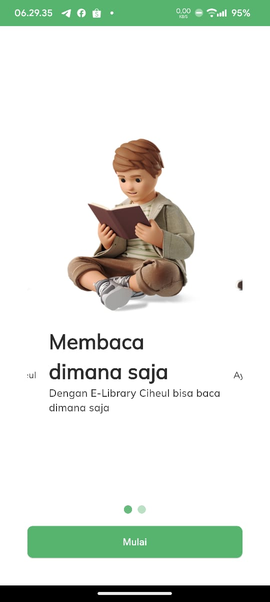
_Gambar 1: Tampilan Intro_


_Gambar 2: Menjelajahi Buku Berdasarkan Kategori_

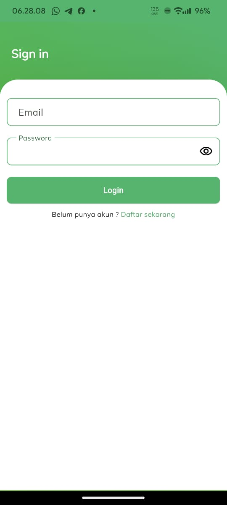
_Gambar 3: Halaman Sign In_

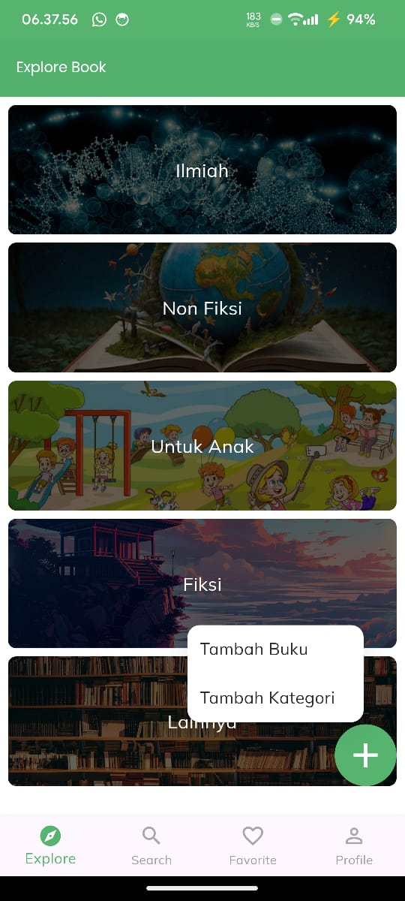
_Gambar 4: Halaman Explore_

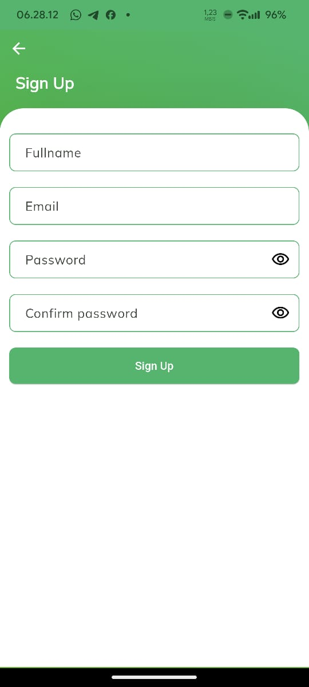
_Gambar 5: Halaman Sign Up_

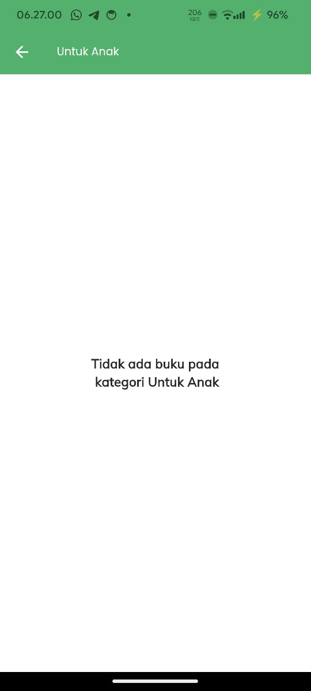
_Gambar 6: Tidak Ada Buku dengan Kategori Dipilih_

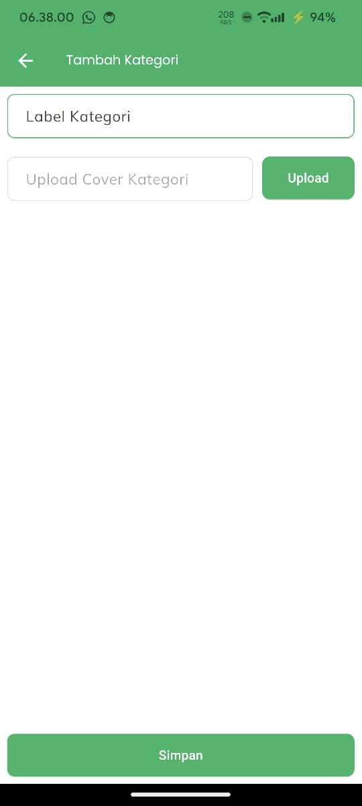
_Gambar 7: Menambahkan Kategori_

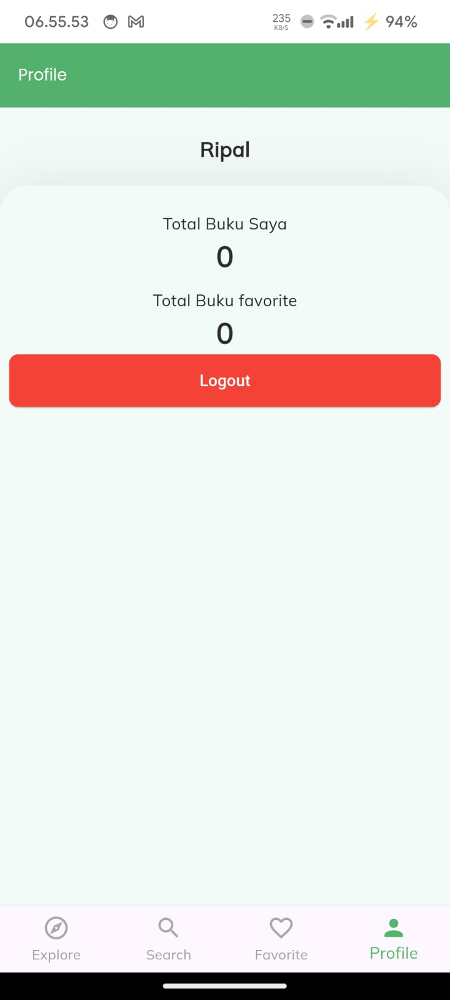
_Gambar 8: Halaman Profil_

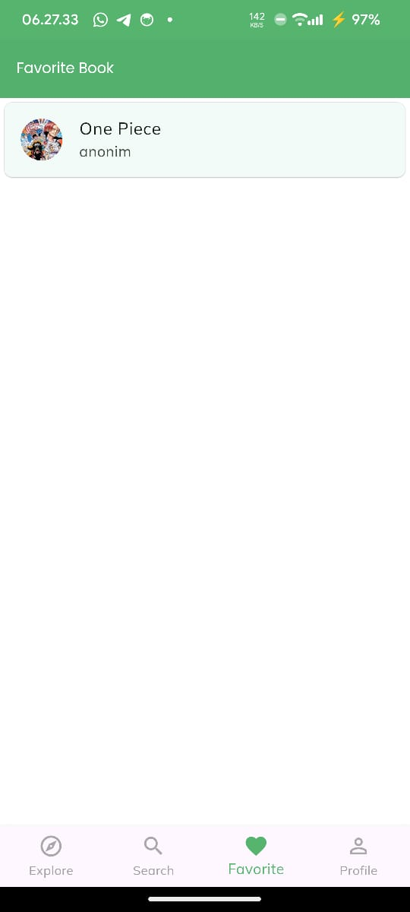
_Gambar 9: Daftar Buku Favorit_

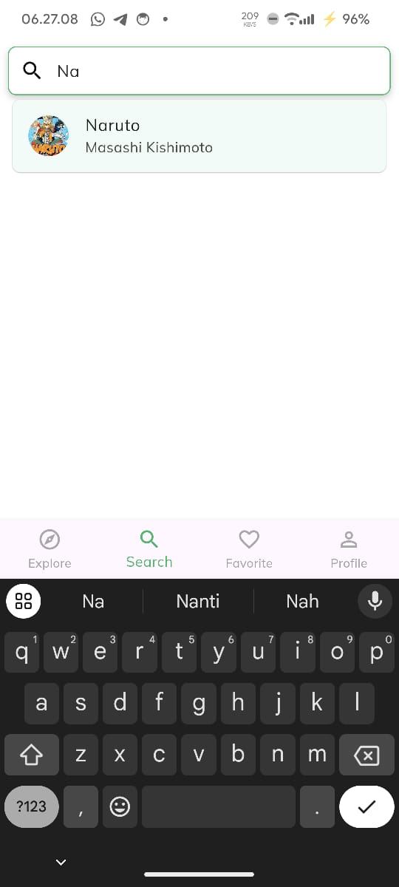
_Gambar 10: Fitur Pencarian Buku_

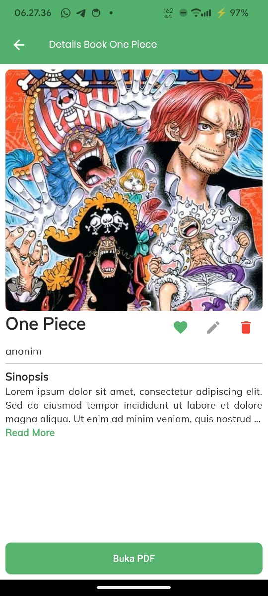
_Gambar 11: Detail Buku_

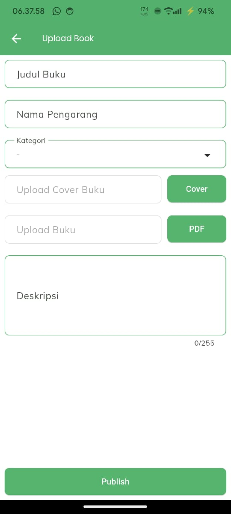
_Gambar 12: Mengunggah Buku_

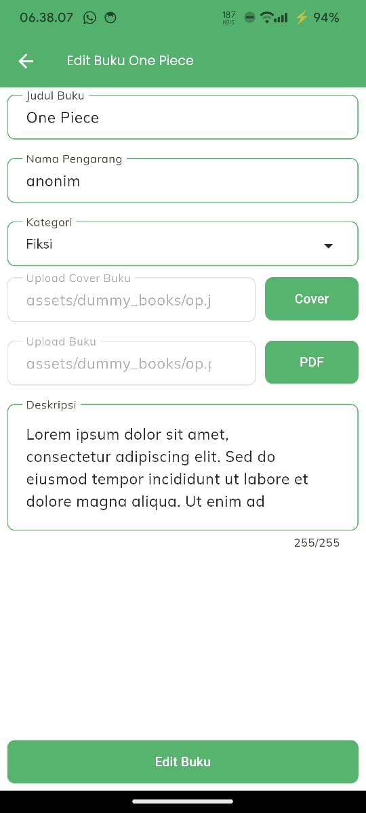
_Gambar 13: Mengedit Buku_
